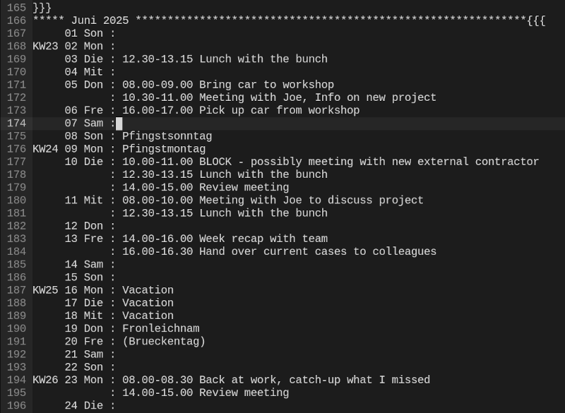

# textcal.vim

`textcal.vim` is a Vim plugin that generates a year-long plain-text calendar
inside a new buffer. It includes public holidays (Germany only), calculates
Easter and related movable feasts, and identifies potential bridge days
("Brückentage") between holidays and weekends.

The calendar is designed for use with outliner-style formats - either as a standalone file or embedded within other plain-text systems (such as [VimWiki](https://github.com/vimwiki)).

## Please note

This plugin was created primarily to support my own organizational workflow, so
its design reflects a number of personal preferences and assumptions. It is not
intended to be a fully customizable calendar generator; certain behaviors and
formatting choices are hardcoded.

For example: The calendar includes a Vim modeline that references the
'rs_outliner.vim' syntax file, which is used to colorize the output. This
syntax file is not included with the plugin.

All holiday calculations, as well as names for days and months, are tailored to
German regions.

As a result, the default setup may not suit everyone’s needs out of the box -
but feel free to tweak and adapt it to your own workflow. :-)

Current limitations:

- Only supports years ≥ 2000
- All names, holidays, and calculations are specific to Germany
- Output format is not customizable

## Features

- Generates a full-year calendar for any year ≥ 2000
- Displays:
  - Calendar weeks (ISO/DIN 1355 standard)
  - Public holidays (Germany)
  - Movable feasts (e.g., Easter, Pentecost, Christmas)
  - Annotations for potential bridge days
- Each month is wrapped in an outliner-style fold (for easy text folding in Vim)
- Outputs to a new buffer and sets the filename to `textcal-<year>.txt`


## Installation

Download the plugin file textcal.vim and place it in your Vim plugin directory.

## Usage

To generate a calendar for the current year, execute the command:

```
:TextCal
```

To generate a calendar for a specific year (e.g., 2026):

```
:TextCal 2026
```

A new buffer will open with the calendar, and the filename will be set accordingly.

## Example Output

Here’s what the generated calendar looks like in use:



